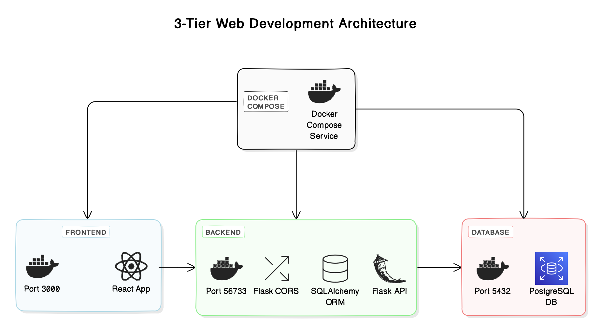

# 3Stack-RFP




This repository contains the source code for a full-stack web application developed using Docker, React, Flask, and PostgreSQL.

## Overview

The application consists of three main services:

1. **Frontend**: A React-based frontend application.
2. **Backend**: A Flask-based backend API server.
3. **Database**: A PostgreSQL database server.

## Getting Started

### Prerequisites

- Docker and Docker Compose installed on your system.

### Installation

1. Clone this repository to your local machine:

    ```bash
    git clone https://github.com/AppleBoiy/3Stack-RFP.git
    ```

2. Navigate to the project directory:

3. Build and start the Docker containers using Docker Compose:

    ```bash
    make build
    ```

5. Access the application in your web browser:

    - Frontend: [http://localhost:3000](http://localhost:3000)
    - Backend API: [http://localhost:56733](http://localhost:56733)
    - Database: PostgreSQL database running on port 5432

## License

This project is licensed under the [MIT License](LICENSE).
